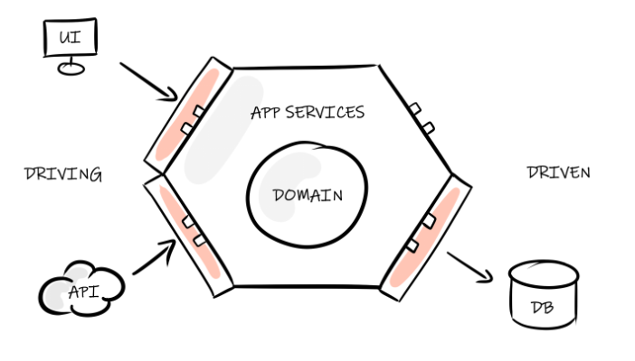

# 💰 **Bank Account** 💰

# Sujet

Ce kata est un challenge d'[architecture hexagonale](https://fr.wikipedia.org/wiki/Architecture_hexagonale), il s'implémente par étape avec un **1er focus sur le domaine métier**.
 

### Etape 1 - Le modèle métier

Implémentation de la logique métier d'un compte en banque:

```
Fonctionnalités attendues:

1. Dépot d'argent
2. Retrait d'argent
3. Consulter le solde actuel
4. Consulter les transactions précédentes

```

Proposer une modélisation objet adaptée des entités necéssaires à ces fonctionnalités.


### Etape 2 - Adapteur API

Exposition des différentes fonctionnalités sur une API REST(Spring par ex.)

### Etape 3 - Adapteur de Persistence

Implémentation d'un adapteur de persistence de votre choix (SQLlite, H2, ...).

## Bonne chance !





# Note d'intention


## ⚠️ MVP ⚠️

>Le kata a volontairement un scope très large : il a vocation à être affiné tout au long de votre montée en compétence chez Exalt. Pour une candidature cependant, concentrez-vous sur **l’implémentation d’un domaine métier complet**, testé, et accessible depuis **une API Rest** ou à minima une CLI. 

___


## Objectif & contexte: mise en place d'un projet en architecture héxagonale.


Dans certains pans de l’industrie, **la logique métier n’a pas le droit à l’erreur**. Ex : Secteur bancaire. Dans ces cas, le code responsable du métier doit être aussi isolé que possible, afin d’être **protégé** de la lourdeur des dépendances aux frameworks externes. 

C’est la promesse de l’[architecture hexagonale](https://fr.wikipedia.org/wiki/Architecture_hexagonale). On définit dès le début la logique métier stricte de notre application, et tout composant externe (ex : Base de données, Controler API, CLI, …) est référencé **au travers de l’abstraction d’une interface**. 

Par exemple, on ne se souciera pas de savoir si notre base de données est Postgresql ou SQLite. Notre code métier interagit avec une interface « RelationalDatabase », et le choix d’une solution de base de données plutôt qu’une autre intervient aussi tard que possible dans le processus de développement. Comme dans une équation mathématique, où on remplace les x et les y au dernier moment. 

Ainsi, on isole la logique du métier des dépendances aux différents frameworks qui composent le software. **La logique métier peut donc être modifiée, testée, validée indépendamment.**


___
## Specification [RFC2119](https://microformats.org/wiki/rfc-2119-fr) du kata

**1. Implémentation de la logique métier d’un compte bancaire, de manière isolée et protégée** 


* Les fonctions implémentant la logique du compte bancaire, par exemple « DepositMoney(int amount) » `DOIVENT` fonctionner indépendamment de toute notion d’API / de base de données. Pour ce faire, ces composants externes `DOIVENT` être représentés de manière abstraite, par des Interfaces. 


* Les fonctions métier `DEVRAIENT` être transparentes vis-à-vis des use-cases métier qu’elles implémentent _(pattern Use-Case, Spec as Code)_


**2. Créations d’adapteurs autour de notre noyau métier**

- Adapteur Web : création d’un contrôleur API. Routes http servant les fonctions du domaine métier. Les routes `DEVRAIENT` suivre les conventions de nommage [OpenAPI](https://restfulapi.net/resource-naming/) (verbes, URI, codes de retour, …) 


- Adapteur Persistance : implémentation de l’interface de persistance de données. L’implémentation `PEUT` être par exemple: 

    * Une base de données gérée avec un ORM 
    * Un fichier .csv, ça fait le travail ;) 


L’architecture hexagonale, contrairement à l’architecture MVC, impose de développer & valider le domaine métier avant de travailler toute autre brique logicielle. Votre historique de commit `DEVRAIT` refléter cet ordre. Ce domaine `DOIT` être validé par des tests unitaires _(exemple Java : Junit5 + @parameterizedTest)_. Pour l’implémentation des tests, le candidat `PEUT` utiliser une approche [TDD](https://fr.wikipedia.org/wiki/Test_driven_development). 

 


